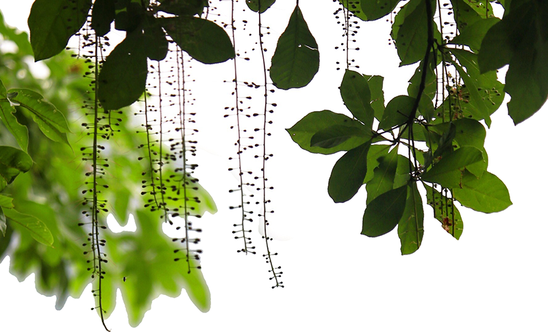

## Hi there,

This is kaalam, the authors of the Jazz platform.

  * Our Twitter account is [@kaalam_ai](https://twitter.com/kaalam_ai)

  * Our (somewhat outdated) website [kaalam.ai](http://kaalam.ai/)

## What is jazz

  * The main project is [Jazz](https://github.com/kaalam/Jazz), trying to build lifelong learning systems in C++.

  * The system generates code automatically using human-written examples and learns in few shots.

  * The science making this possible is [Formal Fields](https://arxiv.org/abs/2007.14075).

  * An easier introduction can be found in [slides](https://www.slideshare.net/SantiagoBasalda/jazz-open-expo-europe-june-2020).

  * The whole PoC implementation in Python applied to the ARC challenge can be found in [JazzARC](https://github.com/kaalam/JazzARC)

## Our current challenges are

  * Building a community! We need help.

  * Releasing [Jazz](https://github.com/kaalam/Jazz) 0.4.1. The first C++ implementation of Formal Fields

  * Combining multiple Formal Fields in a lifelong learning system. (PoC and paper in preparation)

